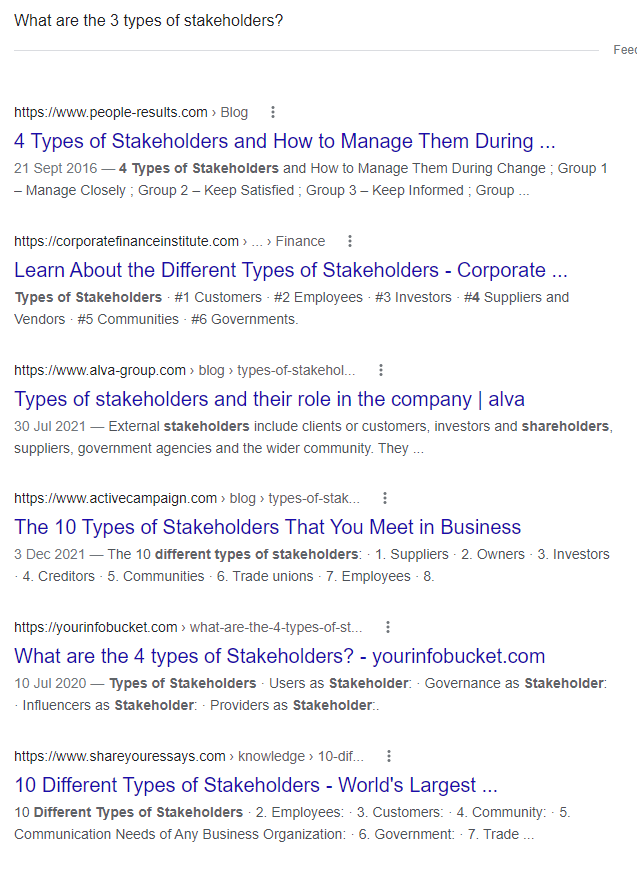
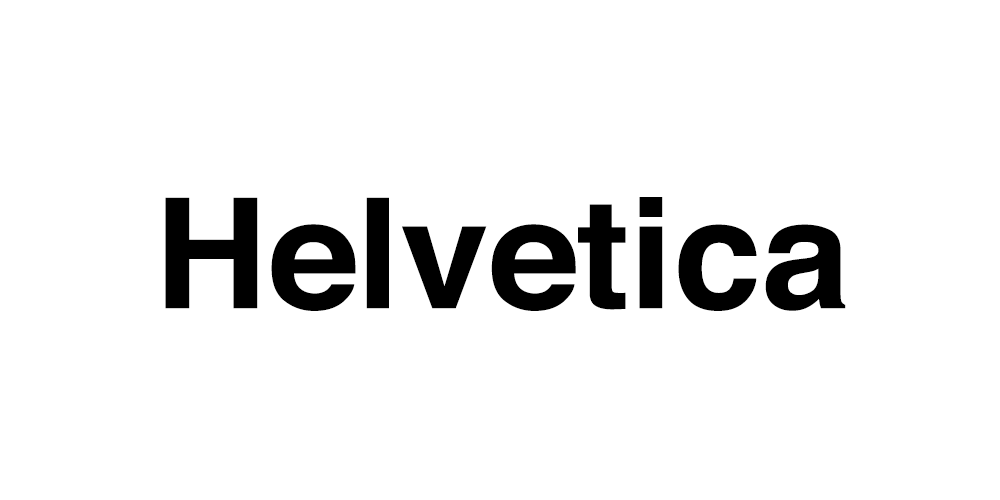
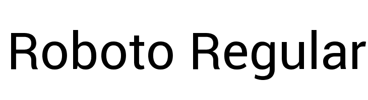
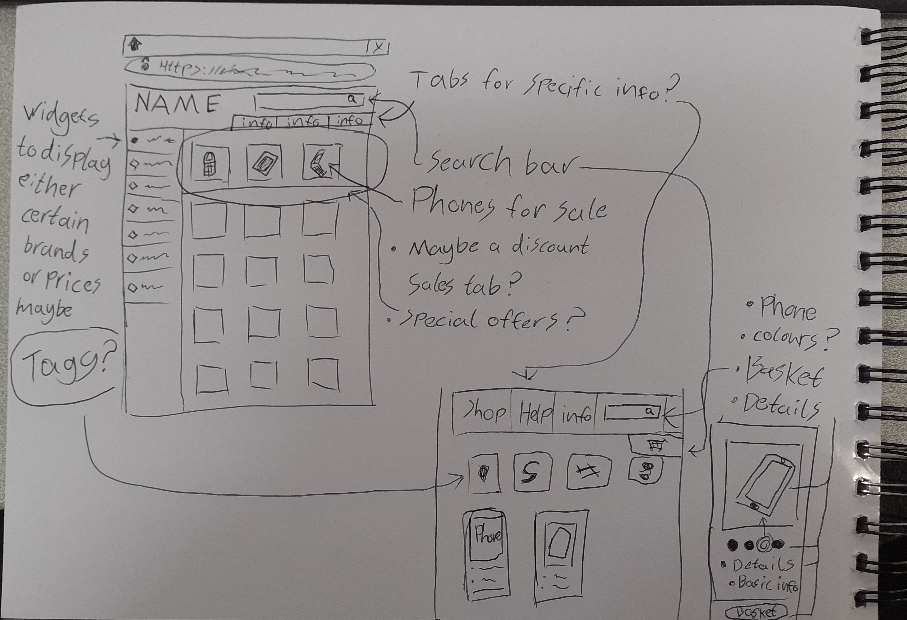
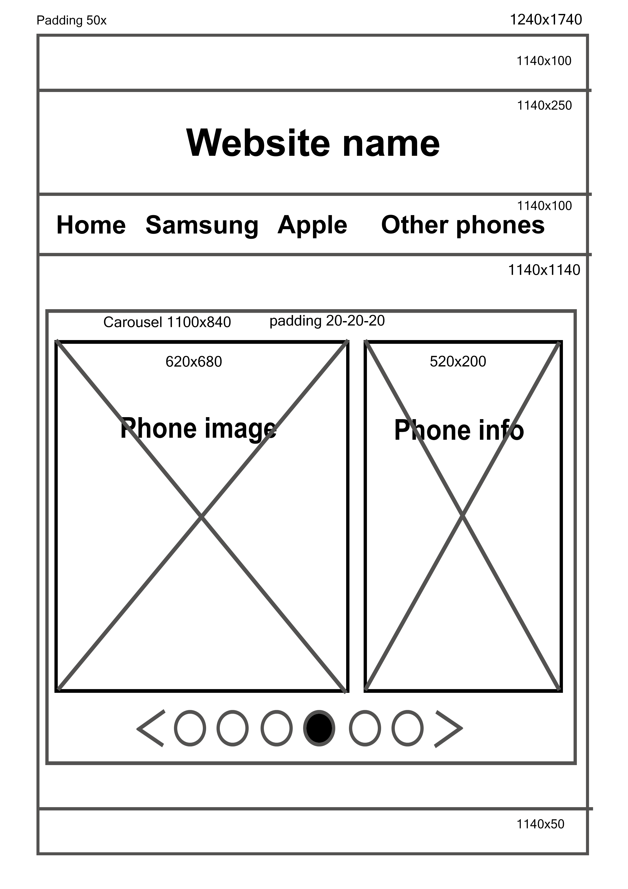

# Designing a website for a small independent mobile phone company

# Stakeholders

    What Is a Stakeholder?

A stakeholder is a party that has an interest in a business or enterprise and can either affect or be affected by the business.

Typical stakeholders are investors, employees, customers, suppliers, communities, governments, or trade associations.

An entity's stakeholder(s) can be both internal or external to the organization.

    The different types of stakeholders

Info is pretty conflicting on exactly how many types of stakeholders there are but here i've melted them all down to their base 4 categories to make things easier.

+ Users
+ Providers
+ Influencer's
+ Governance

These four categories of stakeholder-y-ness villainy make the acronym UPIG. Do what you will with this information idk.

I mean really look at this shit. Idk man.

#

## Customers

+ Product information
  + The top 10 phones on sale
  + Cost price and resale value
  + Phone information: Parts, Version, Battery size etc...
+ Simple / Easy to access
  + Making sure the website isn't overly complicated for use
  + Easy to find when searching online and accessing the website
+ Easy to navigate
  + Search bar
  + Section tabs for products
  + Tag searching (I.e. Phones under a certain price, Specific brands and so on.)
+ Quick loading
  + Website loads fast preferable in 2 seconds or less

## Owners

+ Needs to look good
  + Well organized and designed space
  + Visually pleasing to look at (Not absolute dog vomit)
+ Professional
  + Same as previous just making sure everything is in order and not a jumbled mess
+ Generate business
  + Making sure that the website will be profitable with it's easy access and design
+ Cheap

## Developers

+ Well documented
  + Just making sure its all documented right
+ Maintainable
  + Making sure the website works
+ Easy to test
  + Its self explanatory
+ Follows standards
  + That it follows the standards of stuff man.

# Specification

Making sure the website has good components including:

+ Design
+ Colour
+ Typography
+ Imagery
+ Layout
+ Navigation

# Implementation

+ Testing

# Colours

A good website needs a good colour palette.

To come up with a good colour scheme for this website I took a look at what other websites used most often and also had a look at some colour palettes others had made online.

## What others used

These examples are colours used by various websites including:

+ ee
+ Samsung
+ Buy mobiles
+ Ebay
+ Amazon

## My own ideas

When looking at a palette I liked I took inspiration from a few different things including self preference.

 In the end I settled on the following two palettes: 

 One consisting of mixed blues and greens as they make a nice chill ocean-y kind of mix that I've seen a few times on websites like Samsung and Buy mobiles which sell products that the website I am aiming to create will be selling. 

 The other mix consists of a lot of golds and browns alike to amazon and sand. I dunno man I just picked em cause I liked em. 

 In the end I decided i'm going to go with the first palette as I liked it more than the other.

#

<b>

> ### Primary colour

+ #718EA4 - #718EA4
+ #496D89 - #496D89
+ #29506D - #29506D
+ #123652 - #123652
+ #042036 - #042036 

> ### Secondary colour (1)

+ #7A86AD - #7A86AD
+ #505F90 - #505F90
+ #2F3F73 - #2F3F73
+ #172556 - #172556
+ #071339 - #071339 

> ### Secondary colour (2)

+ #6A9E99 - #6A9E99
+ #42847D - #42847D
+ #236A62- #236A62
+ #0D4F48 - #0D4F48
+ #01342F - #01342F 

> ### Primary color

+ #FFCAAA - #FFCAAA
+ #D4926B - #D4926B
+ #AA6339 - #AA6339
+ #803D16 - #803D16
+ #542102 - #542102 

> ### Complement color

+ #FFF4AA - #FFF4AA
+ #D4C66B - #D4C66B
+ #AA9B39 - #AA9B39
+ #807216 - #807216
+ #544902 - #544902
</b>

#

# Font

I had a look at some fonts online and had a look at what would be best for the website. A few fonts that caught my eye were:

+ Helvetica 
 
+ Sora 
 
+ Montserrat 
 
+ Roboto 
 

# Notes / ideas

Need 2 storyboards to show web design ideas.

Website needs to have:

+ 1 video
+ 1 table
+ 7 pages

Hover/tap on image to show phone details

## Notes

  

   

   

#

# Asset list

A list of assets I will need for the website.

This includes:

+ Website logo
+ Phone images
+ Video
+ Fonts
+ Icons

## Credited assets

Made by me:

+ ICUPhones logo

#

Phone information and images:

+ Currys mobile

#

Colour palettes:

+ Paletton

#

Copyright:

None of the images or information used is for any actual monetary use and is purely for educational uses and follows the rules of fair use.

In no way is any of the information or material used in this project for any other intended use than for these reasons.

#

>*"One of several statutory exceptions to copyright protection. Codified in Section 107 of the Copyright Act, fair use allows persons other than the copyright owner to make certain limited uses of copyrighted material without the copyright owner's permission (17 U.S.C. § 107). Fair use is an affirmative defense to copyright infringement.
Determining fair use requires a fact-based analysis that takes into account the:*

+ *Purpose and character of the use.*
+ *Nature of the copyrighted work.*
+ *Amount and substantiality of the portion used in relation to the copyrighted work as a whole.*
+ *Effect of the use on the potential market for or value of the copyrighted work.*

> *Purposes that may support a finding of fair use include:*

+ *Teaching, including private study or classroom use.*
+ *Criticism or commentary.*
+ *News reporting.*

*(17 U.S.C. § 107.)*

#

# Test plan

Things that need to be tested and checked to make sure the website is working alright.

+ Make sure the page links work properly (Navigation from home to phones and so on from each page)
+ Test the web sizes are correct/look alright
+ Get feedback from colleagues

# Testing

+ ## Chrome
  - I started off with chrome and loaded the website. Initially no issues to start.
     
  - I tested the page at varying widths and found that the main text and image for the banner would seem to break with its text wrapping. Alongside that when switching pages there seemed to be an odd bug where the size of the box would readjust wrong and result in a dark grey bar at the bottom of the carousel. 
      
  - Moving on I tested the page links and all were responsive and worked when traversing between pages. Similarly so I tested my other pages by altering the window width to see if any bugs occurred like the first page and they seemed to have no issue.
      
  All the links between 'Home', 'Top Deals', 'Phones' and 'About' alongside that the links on the carousel to the individual phones and the links to phones in 'Top Deals' & 'Phones' sections of the website also worked just fine with no issue.

#

+ ## Firefox

  - Moving on I then repeated the steps used to test Chrome with Firefox.
     
    Quickly I found that there were very few differences to the issues I was having on Chrome. 
    
    The only difference I noticed was that the pages loaded slightly faster on Firefox compared to Chrome.
